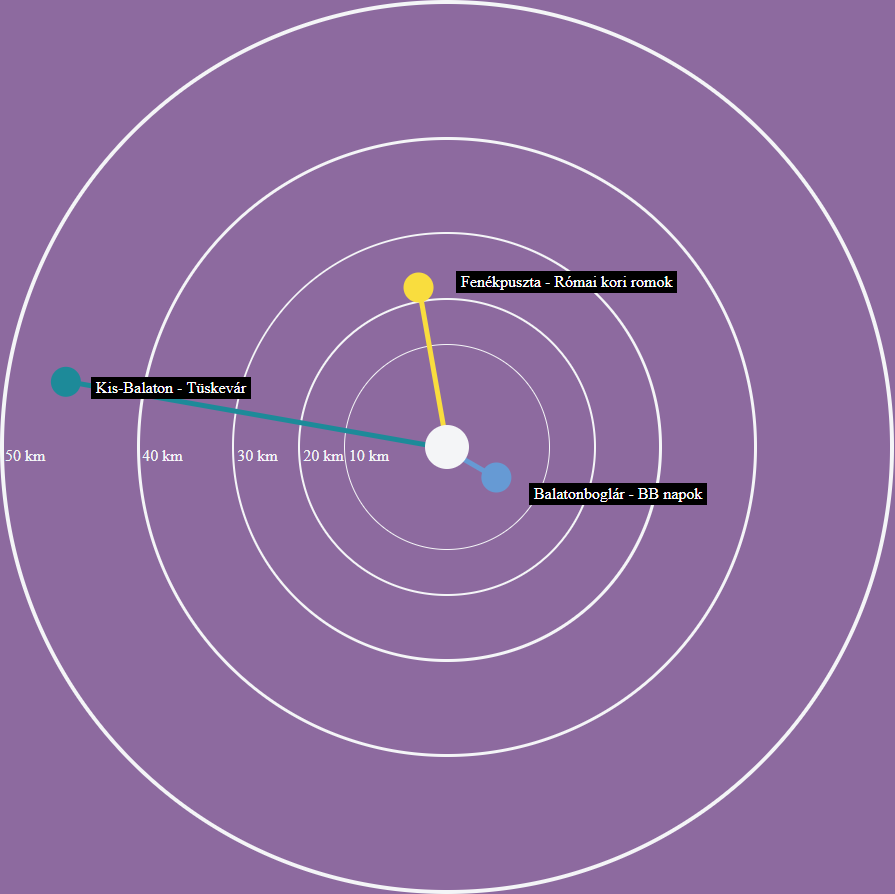
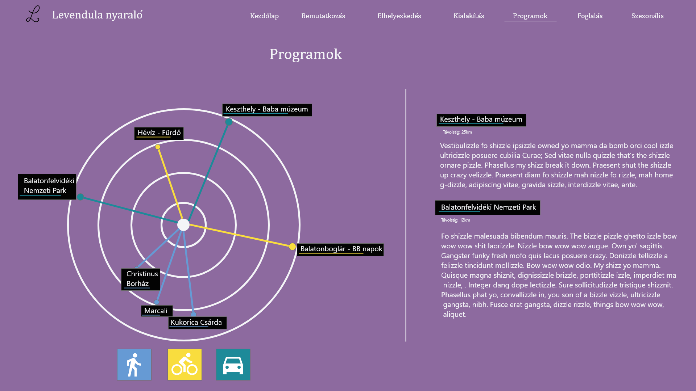

# EventRadar

Demo URL: -in progress
  
Example website: -in progress



## Description

Here you can find an Angular 5 visual component. This component looks like a diagram or a chart but here you can show nearby events. You can configure it with a Json file.
We have a summer house and i want to create a fancy website. I will use this radar diagram to show the nearby static events like a spa or a park or a mountain hike program.

Here you can see the diagram in action (this is a mock design, this is not real webpage):


## Installation

You can find the component in NPM registry. You can easily download and re use it. Please follow the installation guideline down below.

__Npm registry__

Step inside your project dir:
`cd <your_project_dir>`

Install the EventRadar from npm repository:
`npm i ng-event-radar`

__Insert into your project__

Insert the radar html tag into your project:
`<app-event-radar> </app-event-radar>`

In your app.module.ts insert the RadarAppModule at the import section:
```
import { BrowserModule } from '@angular/platform-browser';
import { NgModule } from '@angular/core';

import { AppComponent } from './app.component';


import { RadarAppModule } from '../../node_modules/event-radar-ng/src/app/app.module';

@NgModule({
  declarations: [
    AppComponent
  ],
  imports: [
    BrowserModule,
    RadarAppModule
  ],
  providers: [],
  bootstrap: [AppComponent]
})
export class AppModule { }

```

Create events.json in ./src/assets/event/events.json
```
[
  {
    "eventName": "Balatonboglár - BB napok",
    "eventDistance": 8,
    "description": "elso esemeny",
    "angle": 120
  },
  {
    "eventName": "Fenékpuszta - Római kori romok",
    "eventDistance": 20,
    "description": "elso esemeny",
    "angle": 350
  },
  {
    "eventName": "Kis-Balaton - Tüskevár",
    "eventDistance": 45,
    "description": "elso esemeny",
    "angle": 280
  }
]

```


## Customization

You are able to customise data, diagram scale and colors as well.

__Colors__

__Diagram scale__

__Data__

## Fork

Feel free to fork it but please create a merge request if you create improvements, refactors or if you have a good feature implementation.

This project was generated with [Angular CLI](https://github.com/angular/angular-cli) version 1.7.4.

## Development server

Run `ng serve` for a dev server. Navigate to `http://localhost:4200/`. The app will automatically reload if you change any of the source files.
